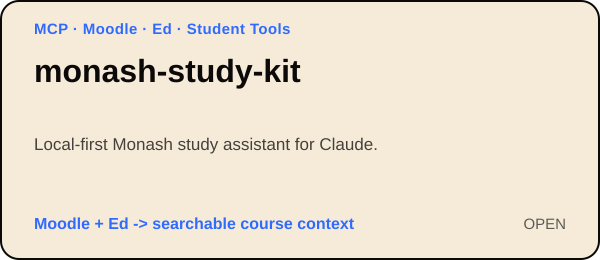
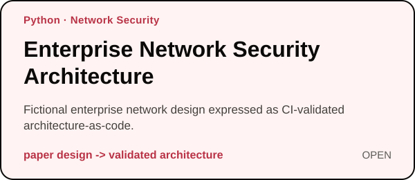
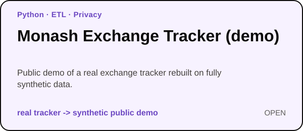

# Hi, I'm Shuoxun Wen 👋

**English** · [中文](https://github.com/Waldo0926/Waldo0926/blob/main/README.zh-CN.md)

  
  
   
  
  

Computer Science student at **Monash University** (Algorithms & Software major), focused on **backend, systems and security engineering**. I build backend services, full-stack products and infrastructure automation, and I enjoy turning applied algorithms into working software.

Based in **Malaysia / China** · open to **software engineering / IT internships**, available **November 2026 – February 2027**.

### Project Landscape

  

📫 **Get in touch**

  
  
  
   
  
  

<strong>📱 Scan to connect</strong>

 

  

---

## Selected Projects

  
  
    
  
  
    
  
  

| Project | Live | Notes |
| :---: | :---: | --- |
| **Monash Hub** | [monashhub.secureview.tech](https://monashhub.secureview.tech) | Solo-built and in production: unit, degree and official-policy search (PostgreSQL full-text + fuzzy), course maps with prerequisite checks, WAM/GPA tools, a student community, and a UI in English, Chinese, Japanese and Korean. |
| **SecureView** | [secureview.tech](https://secureview.tech) | Four-person Final Year Project: browser-side AEAD encryption, key-wrapped sharing, hash-chained audit log. I authored 137 of the team's 158 merged PRs, spanning the security agent, integrity sweep, CI/release gates, capacity and tamper testing, and guarded deployment. Team source repo stays private during assessment. |
| **Monash Study Kit** | [v1.0.0](https://github.com/Waldo0926/monash-study-kit/releases/tag/v1.0.0) | Local-first MCP server (17 tools) + CLI that connects Moodle and Ed to Claude behind Okta/MFA: deadlines, announcements, grades, full-text search over course materials, notes sites and lecture transcripts. Read-only by design; listed on Glama. |
| **Edge Fleet Ops Automation** | — | Sanitized reconstruction of automation for a real Linux edge-node fleet. |
| **Enterprise Network Security Architecture** | — | Fictional enterprise design as architecture-as-code, checked by an automated validator. |
| **Monash Exchange Tracker (demo)** | [live demo](https://waldo0926.github.io/monash-abroad-tracker-demo/) | The private production system has crawled ~164 programs daily since August 2026, honouring `robots.txt`, with field-level change detection, a frozen previous-round comparison, hand-verified QS rankings and an access-controlled viewer. The public demo runs on synthetic data. |

## More Projects

<strong>20 more coursework-derived and independent projects, grouped by area</strong>

 

#### Student Tools & Web Utilities

| Project | What it does |
| --- | --- |
| [ed-web](https://github.com/Waldo0926/ed-web) | A privacy-first, client-side web app for fetching, organising, searching, and summarising Ed Discussion course forums. |
| [monash-attendance-reminder](https://github.com/Waldo0926/monash-attendance-reminder) | A cross-platform Chrome extension that discovers recent Monash Attendance activities, finds codes from Gmail, Moodle, and Ed with local OCR, sends reminders, and submits only after explicit confirmation. |
| [mumguide-wechat-bot](https://github.com/Waldo0926/mumguide-wechat-bot) | A zero-AI WeChat Q&A bot for the 马莫百科 official account: answers in Chinese from taught Q&A, the Monash Hub API and the account's articles, fits WeChat's 5-second reply window, and forwards misses to the owner, learning from his replies. |

#### Software Systems, Networking & Infrastructure

| Project | What it does |
| --- | --- |
| [streamswitch](https://github.com/Waldo0926/streamswitch) | An RxJS packet-routing game demonstrating immutable state, typed event streams, deterministic simulation, and testable functional-reactive architecture. |
| [homelab-network-automation](https://github.com/Waldo0926/homelab-network-automation) | A portfolio reconstruction of iKuai homelab automation with router API integration, guarded connection cleanup, WAN/PPPoE/LAN monitoring, and stateful alert/recovery tracking. |
| [wifi-site-survey-analysis](https://github.com/Waldo0926/wifi-site-survey-analysis) | Privacy-safe Wi-Fi site survey analysis with RSSI, channel usage, and physical-AP-aware roaming overlap. |
| [bike-share-visualizer-cpp](https://github.com/Waldo0926/bike-share-visualizer-cpp) | A modernised C++17 reimplementation of an MFC bike-share station visualiser, with real-data tests and cross-platform CI. |

#### Algorithms, Data Structures & Low-Level Programming

| Project | What it does |
| --- | --- |
| [advanced-string-algorithms](https://github.com/Waldo0926/advanced-string-algorithms) | Pure-Python Ukkonen suffix trees, BWT approximate matching, Z-based exact matching, Rabin-Karp rolling hashes and Miller-Rabin primality testing, with pytest. |
| [classical-algorithms-cpp](https://github.com/Waldo0926/classical-algorithms-cpp) | Classic algorithms in C++: dynamic programming, backtracking, branch and bound, divide and conquer, and genetic algorithms. |
| [data-structures-labs-cpp](https://github.com/Waldo0926/data-structures-labs-cpp) | Modernised C++17 implementations covering stacks, queues, trees, Huffman coding, graphs and sorting. |
| [bst-record-management-cpp](https://github.com/Waldo0926/bst-record-management-cpp) | Modernised C++17 BST record management system with CRUD, persistence, RAII, tests and CI. |
| [n-queens-algorithm-visualizer](https://github.com/Waldo0926/n-queens-algorithm-visualizer) | N-Queens algorithm visualizer with backtracking, state-space pruning, and hill climbing. |
| [MARIE-Bitmap-Text-Renderer](https://github.com/Waldo0926/MARIE-Bitmap-Text-Renderer) | MARIE assembly bitmap renderer with indirect addressing, pointer arithmetic, a 4×8 font, and a memory-mapped framebuffer. |

#### Data, ML & Analytics

| Project | What it does |
| --- | --- |
| [tensorflow-cnn-image-classification](https://github.com/Waldo0926/tensorflow-cnn-image-classification) | Reproducible TensorFlow/Keras CNN experiments on CIFAR-10 and MNIST with automated evaluation. |
| [student-performance-ml-pipeline](https://github.com/Waldo0926/student-performance-ml-pipeline) | Leakage-safe student grade classification with scikit-learn pipelines, SVM, Random Forest, and imbalance-aware evaluation. |
| [pattern-recognition-from-scratch](https://github.com/Waldo0926/pattern-recognition-from-scratch) | Classical pattern-recognition algorithms implemented from scratch with NumPy: Naive Bayes, Perceptron, Fisher LDA, K-Means, FCM, HMM. |
| [million-row-tweet-analysis-bash-r](https://github.com/Waldo0926/million-row-tweet-analysis-bash-r) | Streaming analysis of 1.47M tweets using Unix/Bash pipelines, CSV-safe Python parsing, and R aggregation/visualisation. |

#### Databases, Robotics & Signal Processing

| Project | What it does |
| --- | --- |
| [database-systems-sql-labs](https://github.com/Waldo0926/database-systems-sql-labs) | Database systems labs covering SQL queries, relational design, views, indexes, triggers, stored procedures and cursors. |
| [digital-signal-processing-matlab](https://github.com/Waldo0926/digital-signal-processing-matlab) | MATLAB DSP experiments: FFT, sampling, windowing, FIR/IIR filtering and vital-sign analysis. |
| [puma560-robot-trajectory-planning](https://github.com/Waldo0926/puma560-robot-trajectory-planning) | MATLAB simulation of PUMA 560 robot kinematics, Euler-angle transformations and Cartesian trajectory planning. |

## Technical Focus

`Python` · `TypeScript` · `C++` · `FastAPI` · `Vue` · `Nuxt` · `PostgreSQL` · `MySQL` · `Docker` · `Linux` · `Nginx` · `RxJS` · `MCP` · `Network Security` · `Infrastructure Automation` · `GitHub Actions`

## Portfolio Notes

Some repositories revisit coursework from my earlier undergraduate studies. Where that is the case, I keep the project history explicit and separate the original coursework from later refactoring, testing, documentation, and engineering improvements.

Other repositories are sanitized reconstructions of systems that previously ran in private environments. Those projects preserve the engineering approach while intentionally removing credentials, private topology, operational identifiers, and production-specific details.

**[View all repositories →](https://github.com/Waldo0926?tab=repositories)**
