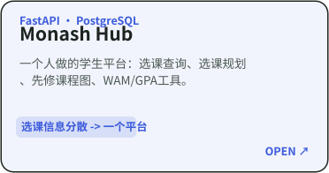
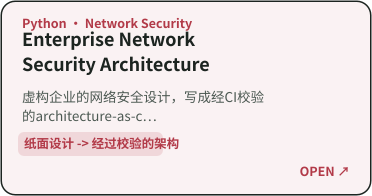
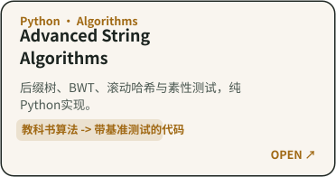

# 你好，我是 Shuoxun Wen 👋

[English](https://github.com/Waldo0926/Waldo0926/blob/main/README.md) · **中文**

 [-eab308?style=for-the-badge)](https://www.monash.edu.my/study/why/our-world-university-rankings)  

Monash University马来西亚校区计算机科学专业学生，主修算法与软件方向。我平时做全栈产品和软件系统开发，比较关注后端工程、安全、系统工程和应用算法这几块。

**马来西亚** · **Monash University**（QS 世界大学排名 2027 位列**第 31 名**）· 目前在找**计算机 / IT 相关实习机会**，时间在 **2026 年 11 月 – 2027 年 2 月**

---

## 精选项目

| | 在线体验 | 说明 |
|---|---|---|
| **Monash Hub** | [monashhub.secureview.tech](https://monashhub.secureview.tech) | 一个人做的学生信息平台，选课查询、选课规划、先修课程图、WAM/GPA 工具。 |
| **SecureView** | [secureview.tech](https://secureview.tech) | 四人期末项目，我负责部署把关、集成/端到端测试、安全整合和文档。团队主仓库在评估期间保持私有。 |
| **Edge Fleet Ops Automation** | — | 从真实 Linux 边缘节点集群运维脚本整理出的脱敏重构，涵盖节点发现、健康巡检、Docker 检查和状态化告警。 |
| **Enterprise Network Security Architecture** | — | 虚构企业的网络安全架构，写成 architecture-as-code，靠 CI 自动校验。 |
| **Monash Exchange Tracker（演示版）** | [在线演示](https://waldo0926.github.io/monash-abroad-tracker-demo/) | 用虚构数据搭建的公开演示，生产系统和真实数据保持私有。 |
| **Advanced String Algorithms** | — | Ukkonen 后缀树、BWT、Rabin-Karp、Miller-Rabin，纯 Python 实现。 |

## 更多项目

其余的课程作业类和独立项目，按方向分了组。上面精选里出现过的项目这里就不重复了。

**学生工具与网页应用**

| 项目 | 做的是什么 |
| --- | --- |
| [ed-web](https://github.com/Waldo0926/ed-web) | 隐私优先的纯前端 Ed Discussion 工具，用于抓取、整理、搜索和总结课程论坛。 |
| [monash-attendance-reminder](https://github.com/Waldo0926/monash-attendance-reminder) | 可配置的 Monash 签到助手：自动发现近期课程，从 Gmail、Moodle 与 Ed（含本地 OCR）查找签到码、发送提醒，并仅在本人确认后提交。 |

**软件系统、网络与基础设施**

| 项目 | 做的是什么 |
| --- | --- |
| [streamswitch](https://github.com/Waldo0926/streamswitch) | 基于 RxJS 的响应式数据包路由小游戏，使用不可变状态、确定性模拟与可测试事件流实现。 |
| [homelab-network-automation](https://github.com/Waldo0926/homelab-network-automation) | 基于爱快 API 的家庭实验室网络监控与连接自动化工具。 |
| [wifi-site-survey-analysis](https://github.com/Waldo0926/wifi-site-survey-analysis) | 隐私安全的 Wi-Fi 现场勘测分析：RSSI、信道使用、物理 AP 去重漫游分析与可复现 Python 可视化。 |
| [bike-share-visualizer-cpp](https://github.com/Waldo0926/bike-share-visualizer-cpp) | 将2021年课程设计中基于MFC的共享单车站点可视化程序，重构为带真实数据测试与跨平台CI的现代C++17实现。 |

**算法、数据结构与底层编程**

| 项目 | 做的是什么 |
| --- | --- |
| [classical-algorithms-cpp](https://github.com/Waldo0926/classical-algorithms-cpp) | C++经典算法：动态规划、回溯、分支限界、分治与遗传算法。 |
| [data-structures-labs-cpp](https://github.com/Waldo0926/data-structures-labs-cpp) | 基于早期 C 风格数据结构课程实验重构的现代 C++17 实现，涵盖栈、队列、树、哈夫曼编码、图与排序。 |
| [bst-record-management-cpp](https://github.com/Waldo0926/bst-record-management-cpp) | 由早期数据结构课程设计重构的现代 C++17 二叉搜索树信息管理系统。 |
| [n-queens-algorithm-visualizer](https://github.com/Waldo0926/n-queens-algorithm-visualizer) | N皇后算法可视化：回溯、状态空间剪枝与爬山算法对比。 |
| [MARIE-Bitmap-Text-Renderer](https://github.com/Waldo0926/MARIE-Bitmap-Text-Renderer) | MARIE 汇编位图渲染器：间接寻址、指针运算、4×8 字体、内存映射显示与 Python 参考模型。 |
| [c-cpp-programming-foundations](https://github.com/Waldo0926/c-cpp-programming-foundations) | C/C++ 编程基础、程序调试练习与 CCF CSP 历年题实践。 |

**数据、机器学习与分析**

| 项目 | 做的是什么 |
| --- | --- |
| [tensorflow-cnn-image-classification](https://github.com/Waldo0926/tensorflow-cnn-image-classification) | 基于 TensorFlow/Keras 的 CIFAR-10 与 MNIST CNN 可复现实验、自动评估与模型结构对比。 |
| [student-performance-ml-pipeline](https://github.com/Waldo0926/student-performance-ml-pipeline) | 基于 scikit-learn 的学生成绩分类：避免数据泄漏，涵盖 SVM、随机森林、超参数调优与类别不平衡评估。 |
| [pattern-recognition-from-scratch](https://github.com/Waldo0926/pattern-recognition-from-scratch) | 使用 NumPy 从零实现经典模式识别算法：朴素贝叶斯、感知机、Fisher LDA、K-Means、FCM 与 HMM。 |
| [million-row-tweet-analysis-bash-r](https://github.com/Waldo0926/million-row-tweet-analysis-bash-r) | 使用 Unix/Bash 流式管道、CSV 安全 Python 解析与 R 聚合/可视化分析 147 万条推文。 |
| [animal-expert-system](https://github.com/Waldo0926/animal-expert-system) | 基于正向链式推理的动物识别专家系统。 |

**数据库、机器人与信号处理**

| 项目 | 做的是什么 |
| --- | --- |
| [database-systems-sql-labs](https://github.com/Waldo0926/database-systems-sql-labs) | 数据库系统课程实验与 T-SQL 实践，涵盖查询、关系设计、视图、索引、触发器与存储过程。 |
| [digital-signal-processing-matlab](https://github.com/Waldo0926/digital-signal-processing-matlab) | MATLAB 数字信号处理实验：FFT、采样、窗函数、FIR/IIR 滤波与生命体征分析。 |
| [puma560-robot-trajectory-planning](https://github.com/Waldo0926/puma560-robot-trajectory-planning) | 基于 MATLAB 的 PUMA 560 机器人运动学、欧拉角变换与笛卡尔轨迹规划仿真。 |

## 技术方向

`Python` · `TypeScript` · `C++` · `FastAPI` · `Vue` · `PostgreSQL` · `MySQL` · `Docker` · `Linux` · `Nginx` · `RxJS` · `网络安全` · `GitHub Actions`

## 作品集说明

有几个仓库是在重做我本科早期的课程项目。遇到这种情况，我会把项目的历史记录保留清楚，把原本的课程作业和后来的重构、测试、文档、工程改进部分区分开。

**[查看全部仓库 →](https://github.com/Waldo0926?tab=repositories)**
